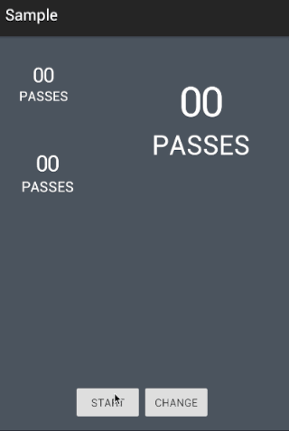

##Inspired by


##Effect


##Usage
In your app's `build.gradle` file,add it to your dependencies:
```
dependencies {
	compile 'org.seniorzhai.scoreboard:scoreboard:1.0.1'
}
```
And in your java code
```java
ScoreBoard scoreBoard = (ScoreBoard) findViewById(R.id.startView);
// start animation
scoreBoard.start();
// start animation for percentage
scoreBoard.start(0.9f);
// change number
scoreBoard.change(99);
// set content text
scoreBoard.setText("BBC");
```
In your XML
```xml
<org.seniorzhai.scoreboard.ScoreBoard
        android:id="@+id/startView"
        android:layout_width="200dp"
        android:layout_height="200dp"
        android:layout_alignParentRight="true"
        app:backcolor="#33000000"
        app:contentText="赞"
        app:forecolor="#FFFFFF"
        app:lineWidth="3dp" />
```
##Sample app
Clone and build this repo in Android Studio to see an example of a sample app. 

##Contact
SeniorZhai:<developer.zhaitao@gmail.com>

